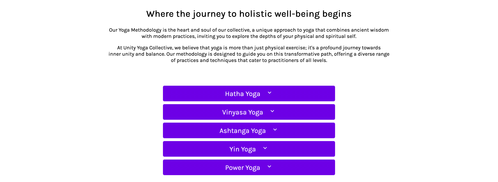
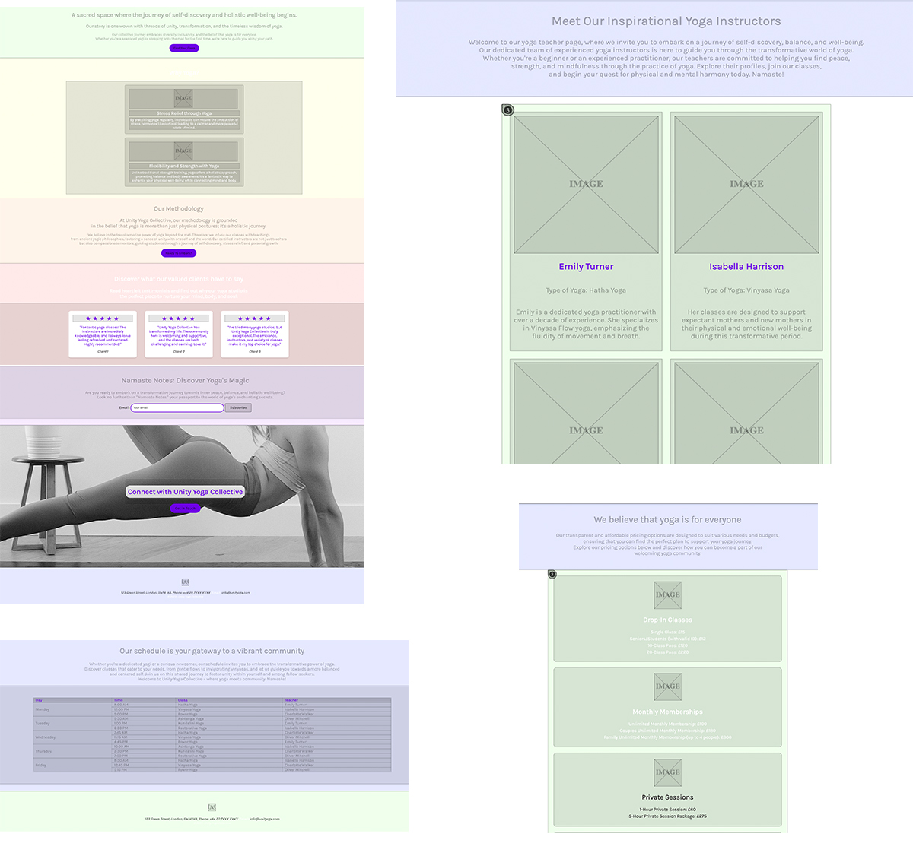

# Unity Yoga Collective Website

Unity Yoga Collective is a serene oasis of wellness and self-discovery. 
The studio offers a holistic approach to yoga and well-being, providing a space where individuals of all backgrounds and abilities 
can come together to explore the transformative power of yoga and mindfulness.

Live webpage [here](https://igordinuzzi.github.io/unityoga/)

## Features

- Navigation with links to all pages, responsive on all devices.
Navigation in a webpage is crucial for providing a user-friendly experience by enabling visitors to efficiently explore and access the site's content, ultimately improving user engagement and satisfaction. 
It helps users find information, products, or services, leading to increased usability and retention.
 

  
- Footer with address and Instagram link.
The footer is essential in a webpage as it often contains important contact information, like an address, and links to social media profiles such as Instagram, enhancing user engagement and accessibility. It serves as a valuable reference point for users seeking to connect with the website's owner or follow them on social platforms.
   

- Favicon for easy recognition.
The favicon is important in a webpage as it provides a recognizable visual identity in browser tabs, enhancing brand visibility and user recognition, and it helps users quickly locate and return to the site.
  
  
- Landing page with methodology, newsletter link, and submission form. The landing page with methodology establishes credibility, a newsletter link encourages user engagement and updates, and a submission form captures valuable leads or data, collectively maximizing the webpage's effectiveness in conveying information and fostering user interaction.
    
  
- Free Yoga Online page with embedded Vimeo videos.
The "Free Yoga Online" page with embedded Vimeo videos offers accessible, engaging yoga content, promoting health and well-being, and attracts and retains visitors by providing a convenient, in-depth resource for yoga enthusiasts.
  
  
- Teachers page with teacher profiles. The "Unity Yoga Collective Teachers" page with teacher profiles is essential for users to learn about instructors' qualifications and teaching styles, fostering trust and helping students make informed choices when selecting the right teacher for their needs. It enhances the overall user experience and facilitates a more personalized approach to yoga instruction.

  
  
- Methodology page with yoga types in an accordion. The "Methodology" page with yoga types in an accordion format offers organized, accessible information, allowing users to explore diverse yoga styles and understand the methodology behind them, promoting a more informed and engaging yoga experience. It enhances user education and engagement with the content.

   
  
- Schedule page with class details. The "Unity Yoga Collective Schedule" page with class details is important in a webpage because it provides users with up-to-date information about class times, styles, and instructors, helping them plan their participation and fostering a sense of reliability and trust in the yoga program. It enhances user convenience and encourages regular attendance.
  
  
- Pricing page with package information. The "Unity Yoga Collective Studio Pricing" page with package information is important in a webpage as it helps potential clients understand the cost structure and make informed decisions about their investment in yoga classes, fostering transparency and trust while attracting and retaining customers with clear, accessible pricing details. It aids in user conversion and revenue generation for the studio.
 
 
- Contact page with map, address, and phone details. The "Unity Yoga Collective Studio Contact" page is crucial for users to easily locate the studio, establish a physical connection, and contact the business, enhancing accessibility and trust while promoting in-person visits and inquiries. It provides essential information for user engagement and potential clientele.
  

## Existing Features and Features to Implement

**Existing features:**

- JS Accordion for the methodology page: a JavaScript Accordion implemented on the Methodology page to create an interactive and user-friendly interface that allows users to easily expand and collapse content sections for a more organized and engaging experience. 

**Features to Implement:**

- Fix the newsletter submission form (PHP required: rectify the newsletter submission form by implementing PHP to ensure proper functionality and data processing.
  

## Wireframes

## Technologies

The Unity Yoga Collective website utilizes the following technologies:

- Figma for design.
- Material Icons and FontAwesome for icons.
- CSS for styling.
- HTML for content.
- JavaScript for responsive menu and accordion.
- Visual Studio Code for development.
- GitHub for version control.
- ChatGPT for content creation.

## Testing

The website has been thoroughly tested on various devices and browsers:

- Mobile (iPhone 14)
- Smaller laptop MacBook Air
- iMac

**Responsiveness:**

All pages were tested to ensure responsiveness on screen sizes from 320px and upwards as defined in WCAG 2.1 Reflow criteria for responsive design on Chrome, Edge, Firefox, Safari and Opera browsers.

Steps to test:

- Open browser and navigate to Unity Yoga Collective
- Open the developer tools (right click and inspect)
- Set to responsive and decrease width to 320px
- Set the zoom to 50%
- Click and drag the responsive window to maximum width

Expected:

Website is responsive on all screen sizes and no images are pixelated or stretched. No horizontal scroll is present. No elements overlap.

Actual:

Website behaved as expected.

Website was also opened on the following devices and no responsive issues were seen:

- iPhone 14
- iPhone SE
- Samsung Galaxy Android S20 Android 11
- Macbook Air
- iMac 27''
- iMac 24''

**Accessibility:**

[Wave Accessibility](https://wave.webaim.org/) tool was used throughout the development and for final testing of the deployed website to check for any aid accessibility testing.

Testing was focused to ensure the following criteria were met:

- All forms have associated labels or aria-labels so that this is read out on a screen reader to users who tab to form inputs
- Color contrasts meet a minimum ratio as specified in WCAG 2.1 Contrast Guidelines
- Heading levels are not missed or skipped to ensure the importance of content is relayed correctly to the end user
- All content is contained within landmarks to ensure ease of use for assistive technology, allowing the user to navigate by page regions
- All not textual content had alternative text or titles so descriptions were read out to screen readers
- HTML page lang attribute has been set
- Aria properties have been implemented correctly
- WCAG 2.1 Coding best practices being followed

Manual tests were also performed to ensure the website was as accessible as possible and an accessibility issue was identified.

I've discovered several errors on the webpage, specifically related to color contrast and headers. I fixed these issues to enhance accessibility and ensure that all users can easily navigate and interact with the content, promoting a more inclusive and user-friendly experience.

**Browser Compatibility Checked:**

- Safari
- Firefox
- Google Chrome

**Lighthouse Report:**

- Landing Page
  

- Free yoga videos page
  
  
- Teachers page
  
  
- Methodology page
  
  
- Schedule page
  
  
- Pricing page
  
  
- Contact page
  

W3C Validator found this error: Element title not allowed as child of element head in this context. (Suppressing further errors from this subtree.)

## Deployment:

**Version Control:**

The site was created using the Visual Studio code editor and pushed to github to the remote repository ‘tacos-travels’.
The following git commands were used throughout development to push code to the remote repo:
git add <file> - This command was used to add the file(s) to the staging area before they are committed.
git commit -m “commit message” - This command was used to commit changes to the local repository queue ready for the final step.
git push - This command was used to push all committed code to the remote repository on github.

**Deployment to Github Pages:**

The site was deployed to GitHub pages. The steps to deploy are as follows:
In the GitHub repository, navigate to the Settings tab
From the menu on left select 'Pages'
From the source section drop-down menu, select the Branch: main
Click 'Save'
A live link will be displayed in a green banner when published successfully.
The live link can be found [here](https://igordinuzzi.github.io/unityoga/)

## Credits

- Written content by ChatGPT

**Media:**

- Images by Unsplash
- Illustration by Freepik
- Logo by Igor Dinuzzi
