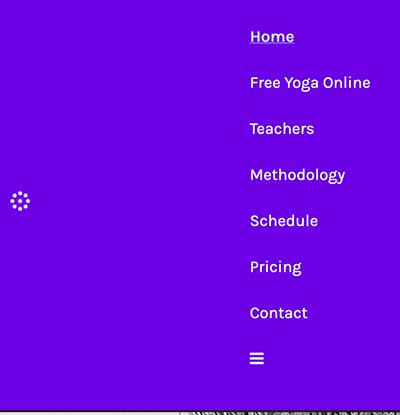

# Unity Yoga Collective Website

## Features

- Navigation with links to all pages, responsive on all devices.
 

  
- Footer with address and Instagram link.
   

- Favicon for easy recognition.
  
  
- Landing page with methodology, newsletter link, and submission form.
    
  
- Free Yoga Online page with embedded Vimeo videos.
  
  
- Teachers page with teacher profiles.
  
  
- Methodology page with yoga types in an accordion.
   
  
- Schedule page with class details.
  
  
- Pricing page with package information.
 
 
- Contact page with map, address, and phone details.
  

## Existing Features and Features to Implement

**Existing features:**

- JS Accordion for the methdology page 

**Features to Implement:**

- Fix the newsletter submit form (PHP required).
  

## Wireframes

- Homepage
  

  - Free Yoga Online
  

## Technologies

The Unity Yoga Collective website utilizes the following technologies:

- Figma for design.
- Material Icons and FontAwesome for icons.
- CSS for styling.
- HTML for content.
- JavaScript for responsive menu and accordion.
- Visual Studio Code for development.
- GitHub for version control.
- ChatGPT for content creation.

## Testing

The website has been thoroughly tested on various devices and browsers:

- Mobile (iPhone 14)
- Smaller laptop MacBook Air
- iMac

**Browser Compatibility Checked:**

- Safari
- Firefox
- Google Chrome

**Lighthouse Report:**

- Performance: 93
- Accessibility: 89
- Best Practices: 100
- SEO: 92

W3C Validator found this error: Element title not allowed as child of element head in this context. (Suppressing further errors from this subtree.)

## Credits

- Written content by ChatGPT

**Media:**

- Images by Unsplash
- Illustration by Freepik
- Logo by Igor Dinuzzi
